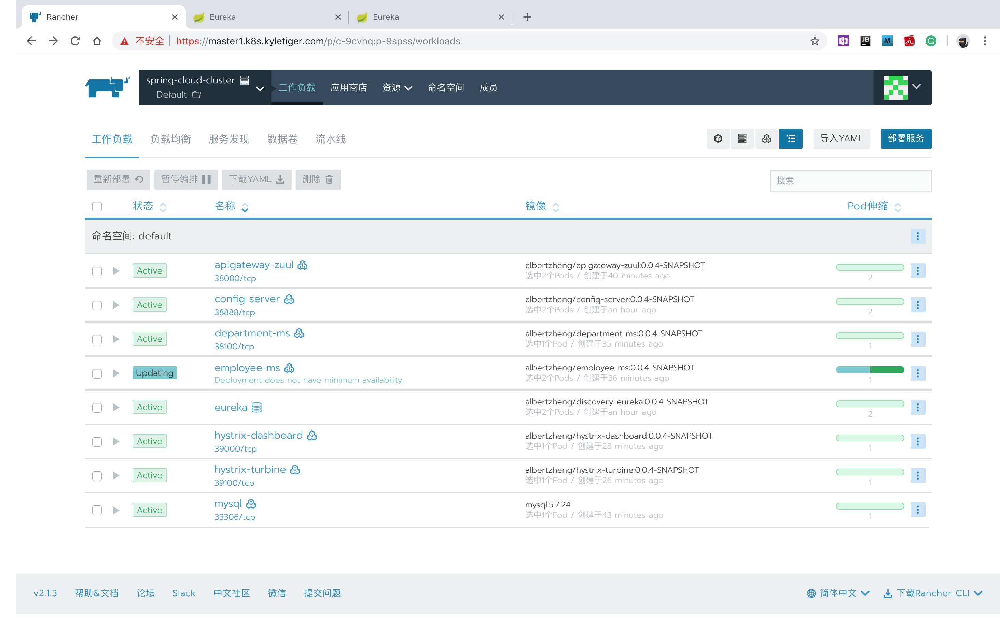

# 项目说明
## 简介

本项目为我在以前采用``spring cloud``全家桶开发的几个互联网应用项目和采用``kubernetes``部署微服务的实战中积累的最佳实践，经过脱敏处理后编写的一个mini微服务演示项目，技术演示了：
1. 一个可快速复制的采用``spring cloud``全家桶开发微服务应用的框架；
2. 一套可快速复制的将``spring cloud``微服务部署到``kubernetes``集群上的部署方案和脚本。

## 在线演示

为方便朋友们“无痛”体验``spring cloud``微服务和``kubernetes``集群部署，我已在Azure云上购买了3台虚拟机，自己搭建了一套``kubernetes``集群，并将该mini微服务演示项目部署到这套集群上。目前正在优化部署中，过段时间将开放这套``kubernetes``集群权限和上面部署的``spring cloud``微服务demo供大家在线体验。在此之前大家可先研究下该项目的源代码。

