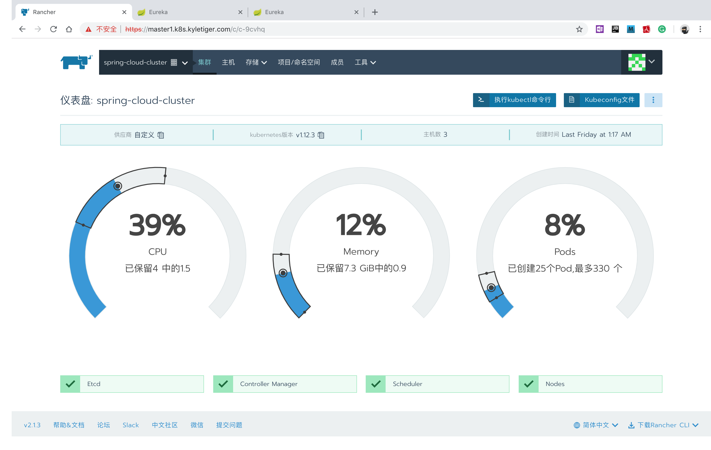
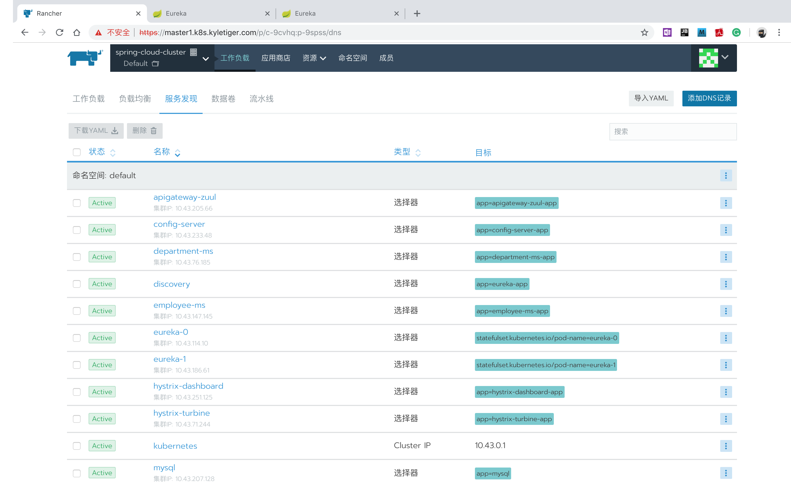
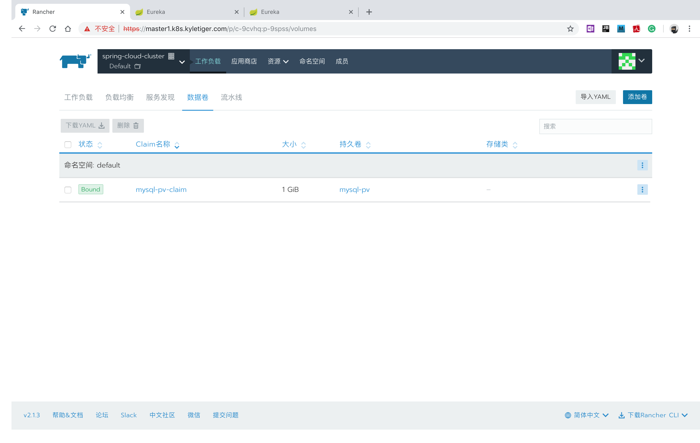
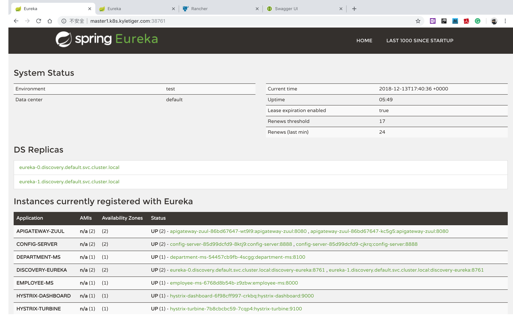
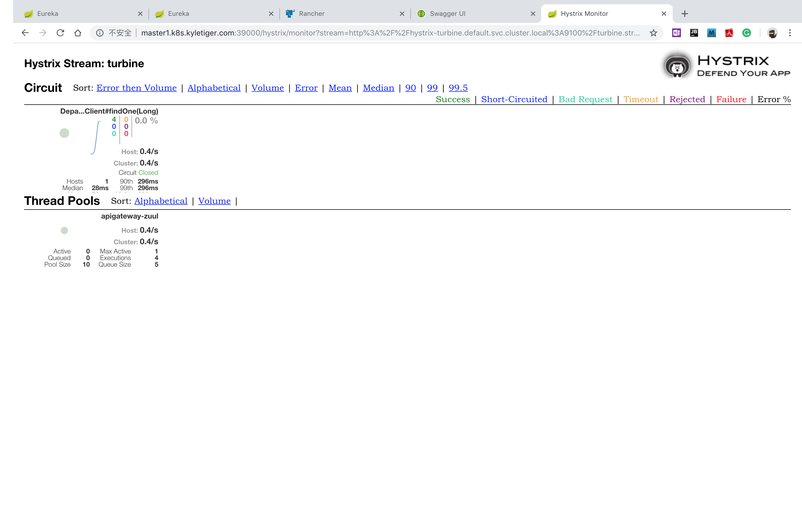
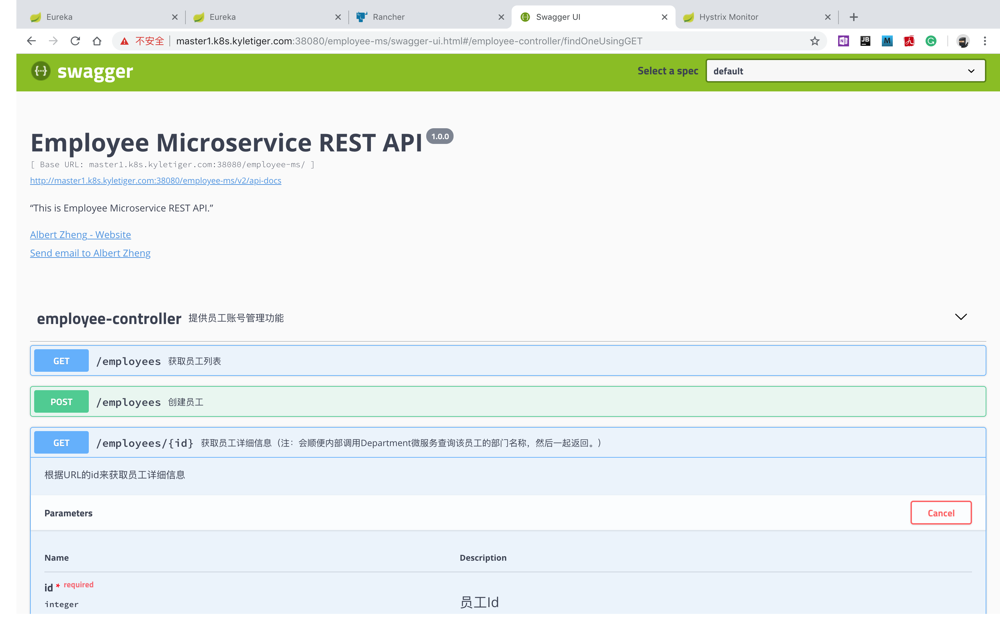

# 项目说明
## 简介

经常有互联网圈的朋友们来咨询关于用``Spring Cloud``全家桶开发微服务应用的问题、以及如何在``Kubernetes``上编排部署``Spring Cloud``微服务、如何寻址的问题，因此萌发了将我以前在几个互联网项目中开发和k8s部署微服务实战中积累的最佳实践提炼出来分享的想法。本项目为一个浓缩了Spring Cloud Microservices on Kubernetes最佳实践的mini微服务应用参考，用于最佳实践的分享，技术演示了：

1. 一个可快速复制的采用``Spring Cloud``全家桶来开发微服务应用的框架；
2. 一套可快速复制的将``Spring Cloud``微服务部署到``Kubernetes``集群上的部署方案和YAML部署脚本（在实践项目应用中，这些YAML脚本应该需要部署到公司的CI & CD pipeline上以实现自动化的CI & CD）。

## 技术栈

1. ``Spring Cloud``全家桶：用于开发微服务应用。采用目前最稳定的``Edgware RELEASE``，最佳搭配的全家桶组件有：
    - 开发：``Zuul``作为API Gateway，``Eureka``作为服务注册治理中心，``Spring Cloud Config``作为配置中心，``Hystrix``作为熔断器、降级和限流，``Ribbon``作为负载均衡，``Feign``作为声明式的REST Client。
    - 监控：``Spring Boot Actuator``+``Spring Boor Admin``提供每个微服务的自省和监控能力、以及可视化监控UI，``Hystrix Dashboard``用于可视化监控Hystrix Metrics，``Turbine``用于聚合各个微服务的Hystrix Metrics，``Sleuth``和``Zipkin``用于分布式调用跟踪。

2. ``Swagger`` & ``Swagger UI``：用于REST API文档和兼作REST API调试。

3. ``MyBatis``：用于``MySQL``数据库访问ORM。

4. ``RabbitMQ``：用于可靠的消息服务中间件。

5. ``Flyway``：秉承``DevOps``的``一切均代码``思想，采用``Flyway``用于数据库升级的配置管理。

6. ``Kubernetes``和``Rancher Server``：作为自动化部署、伸缩和编排微服务容器集群的PaaS平台。

7. 第三库：``lombok``，``guava``

## 在线演示

为方便朋友们“无痛”体验``Spring Cloud``微服务和``Kubernetes``集群部署，我在Azure云上购买了3台虚拟机，自己搭建了一套``Kubernetes``集群，并将该mini微服务演示项目和底层依赖部署到这套集群上。目前正在优化部署中，过段时间将开放这套``Kubernetes``集群权限和上面部署的``Spring Cloud``微服务demo供大家在线体验。在此之前大家可先研究下该项目的源代码。

3台虚拟机的配置：
1. Kubernetes Master node：1台，配置为标准 F2s_v2 (2 vcpu，4 GB 内存)；
2. Kubernetes Worker node：2台，配置为标准 F1s (1 vcpu，2 GB 内存)。

请：不要流量攻击这套集群或漏洞扫描！这套系统只是纯粹用于交流和方便网友，小成本的部署环境而已，没有$去购买高性能虚拟机和WAF网关、抗DDoS等安全防护服务。

## 更新计划

1. 采用``RabbitMQ``让各个微服务实例异步吐出Hystrix Metrics和``Turbine``进行异步采集聚合。
2. 部署上``Zipkin``和``Elasticsearch``：估计虚拟机的配置需要升级才能跑得动:(。
3. ``TCC``柔性分布式事务处理的演示：需要再开发几个演示``TCC``的微服务。
4. ``Spring Data JPA Repositories``+``Hibernate``：演示另一种数据库ORM方案。
5. 文档：增加&完善文档。

## 结语
感谢你的耐心阅读，如有对本项目中的Spring Cloud & Kubernetes的使用或者对本人的编码风格有更好的想法或者建议，欢迎通过邮件 <lisong.zheng@gmail.com>或QQ <40000646@qq.com>与我取得联系，万分感谢。
